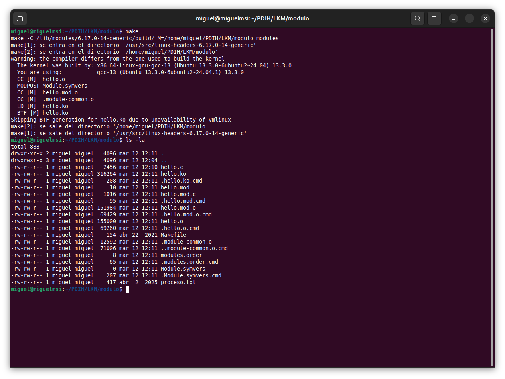
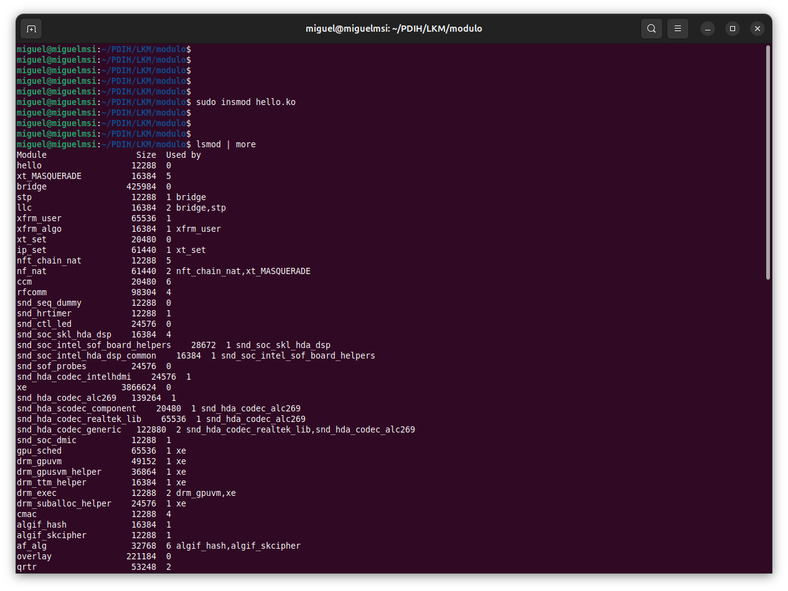
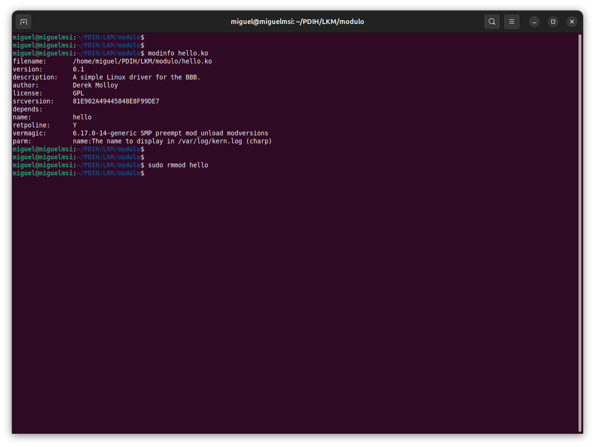
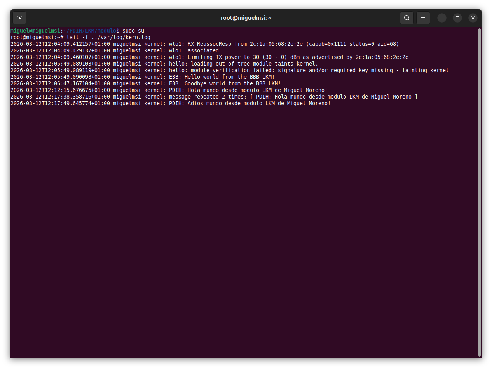

# Práctica: Módulo del Kernel Linux (LKM) – Hello World

**Alumno:** Miguel Moreno Murcia
**Curso/Grupo:** 4º
**Repositorio:** PDIH / Carpeta LKM

## 1. Descripción

En esta práctica se desarrolla y carga un **módulo del kernel de Linux (LKM)** sencillo que muestra un mensaje en el log del sistema cuando:

- El módulo se **carga en el kernel**
- El módulo se **elimina del kernel**

El módulo acepta un **parámetro llamado `name`**, que se muestra en el mensaje del log.

Los mensajes generados se pueden consultar en el archivo: `/var/log/kern.log`

---

## 2. Código del módulo

Archivo: `hello.c`

```c
/**
 * @file    hello.c
 * @author  Derek Molloy
 * @date    4 April 2015
 * @version 0.1
 * @brief  An introductory "Hello World!" loadable kernel module (LKM)
*/

#include <linux/init.h>
#include <linux/module.h>
#include <linux/kernel.h>

MODULE_LICENSE("GPL");
MODULE_AUTHOR("Derek Molloy");
MODULE_DESCRIPTION("A simple Linux driver for the BBB.");
MODULE_VERSION("0.1");

static char *name = "mundo";
module_param(name, charp, S_IRUGO);
MODULE_PARM_DESC(name, "The name to display in /var/log/kern.log");

static int __init helloBBB_init(void){
   printk(KERN_INFO "PDIH: Hola %s desde modulo LKM de Miguel Moreno!\n", name);
   return 0;
}

static void __exit helloBBB_exit(void){
   printk(KERN_INFO "PDIH: Adios %s desde modulo LKM de Miguel Moreno!\n", name);
}

module_init(helloBBB_init);
module_exit(helloBBB_exit);
```
---

## 3. Compilación del módulo

Para compilar el módulo se utiliza el comando:

```bash
make
```

Este comando genera el archivo del módulo del kernel:

```
hello.ko
```

<p align="center">
  
</p>

## 4. Comprobación del módulo compilado

Para comprobar que el módulo se ha generado correctamente:

```bash
ls -l *.ko
```

Este comando muestra el archivo del módulo compilado junto con sus permisos, tamaño y fecha de creación.

## 5. Inserción del módulo en el kernel

Para cargar el módulo en el kernel:

```bash
sudo insmod hello.ko
```

Una vez cargado, podemos comprobar que el módulo está activo con:

```bash
lsmod
```

<p align="center">
  
</p>

Este comando muestra todos los módulos actualmente cargados en el kernel.

## 6. Información del módulo

Para obtener información detallada del módulo:

```bash
modinfo hello.ko
```

Este comando muestra información como:

- Autor del módulo  
- Licencia  
- Descripción  
- Versión  
- Parámetros disponibles  

## 7. Eliminación del módulo

Para eliminar el módulo del kernel se utiliza el siguiente comando:

```bash
sudo rmmod hello.ko
```
<p align="center">
  
</p>

Al eliminar el módulo se ejecuta la función de salida definida en el código.

## 8. Visualización de los mensajes del kernel

Para ver los mensajes generados por el módulo en el log del kernel:

```bash
sudo su -
cd /var/log
tail -f kern.log
```

El comando `tail -f` permite visualizar los mensajes del kernel en tiempo real.

Cuando el módulo se carga o se elimina aparecerán mensajes similares a:

```
PDIH: Hola mundo desde modulo LKM de Miguel Moreno!
PDIH: Adios mundo desde modulo LKM de Miguel Moreno!
```

<p align="center">
  
</p>