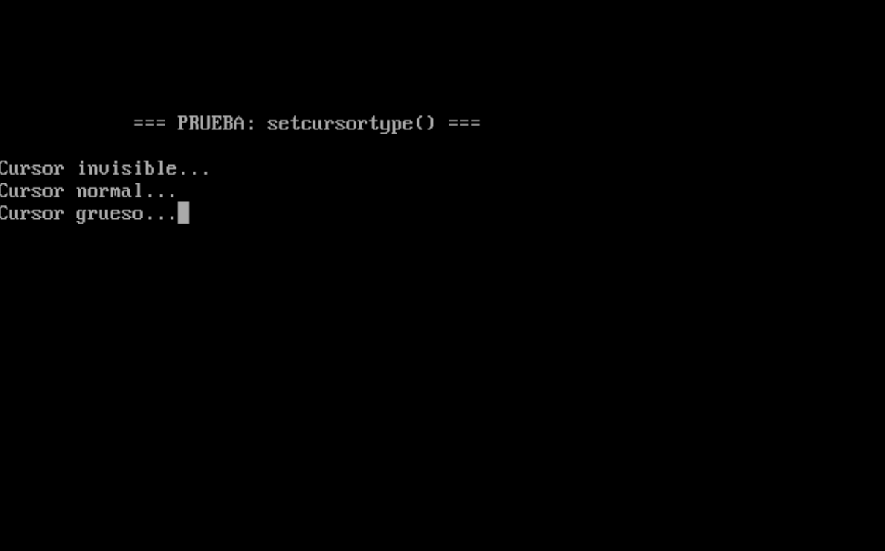
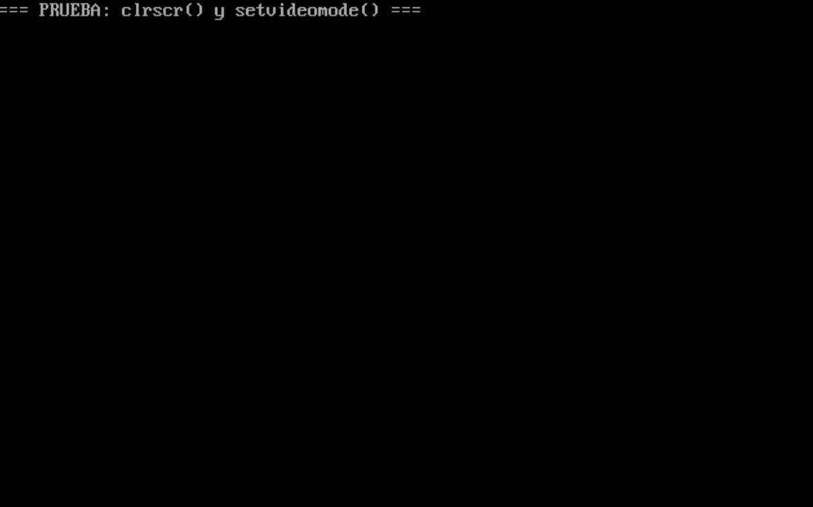
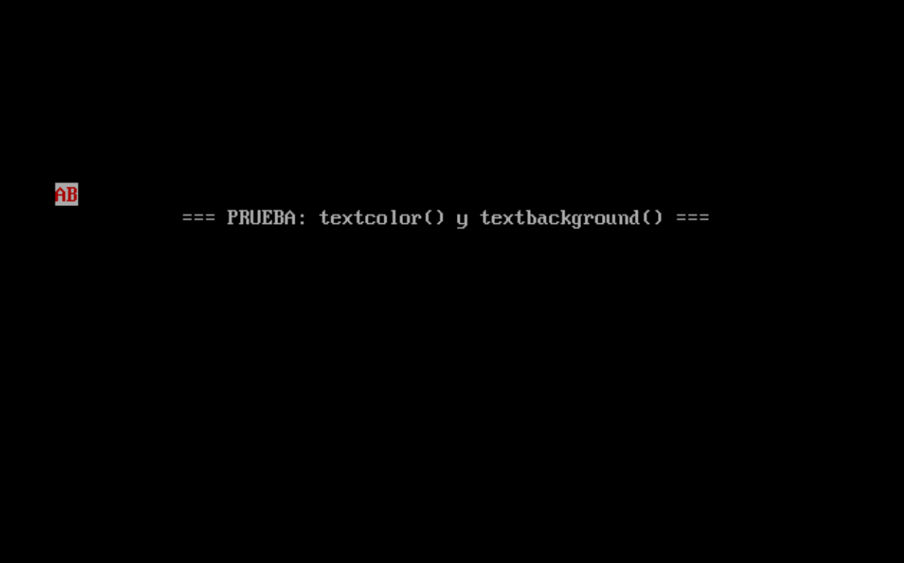
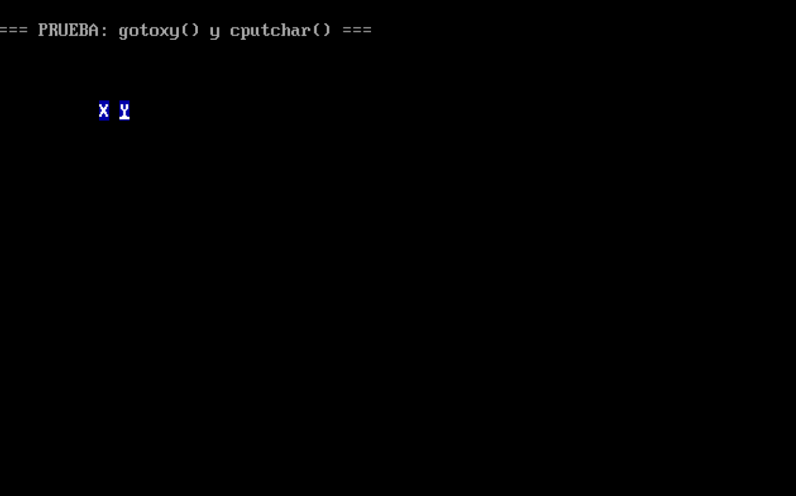
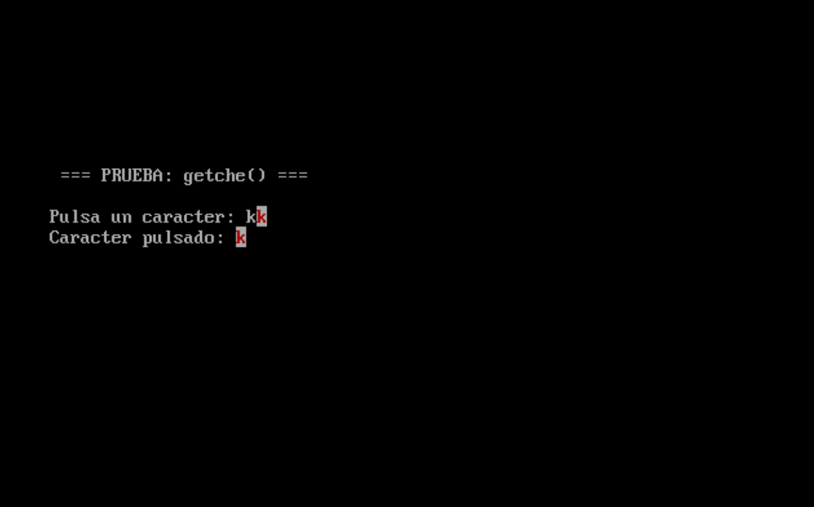
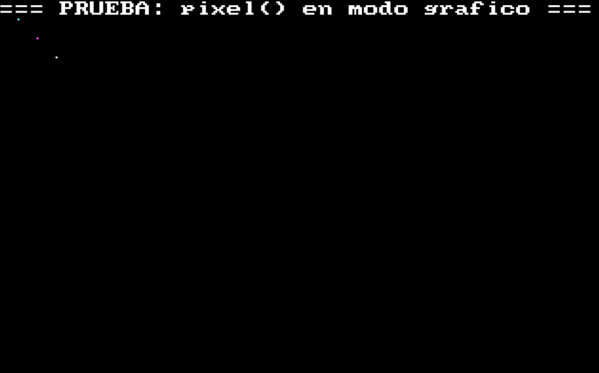
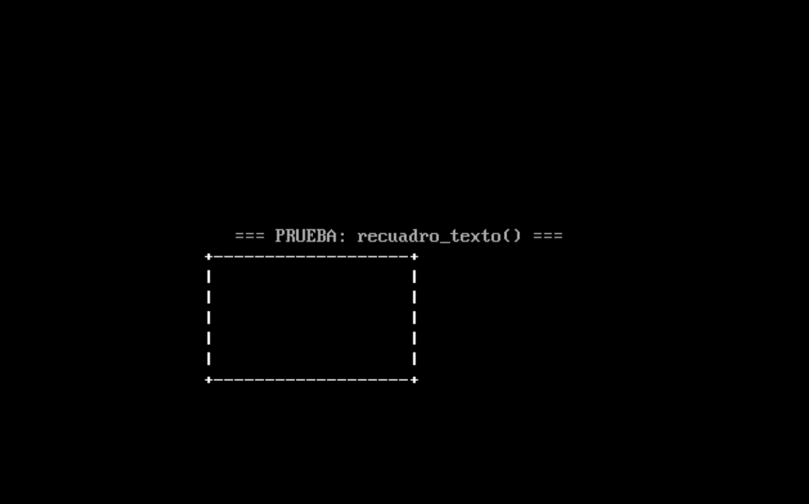
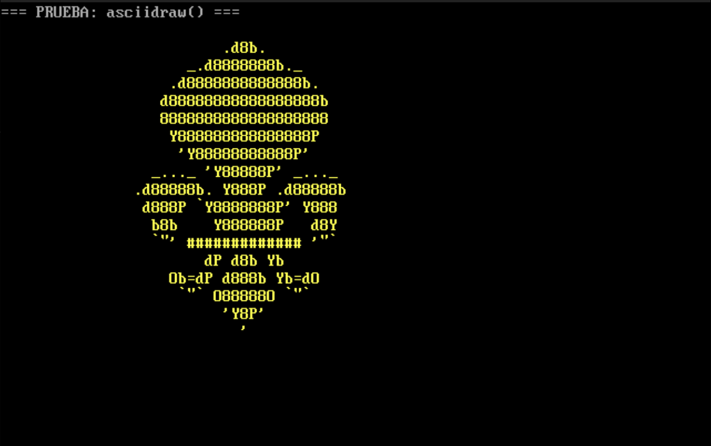

# Práctica 1 – Entrada/Salida utilizando interrupciones con lenguaje C

**Alumno:** Miguel Moreno Murcia  
**Curso/Grupo:** 4º  
**Repositorio:** PDIH / Carpeta P1  

---

## 1. Objetivo

El objetivo de esta práctica es implementar un conjunto de funciones en C que permitan:

- Manipular el **modo de video** en DOS (texto y gráfico).  
- Cambiar **colores de texto y fondo**.  
- Mover el **cursor** y cambiar su tipo (invisible, normal o grueso).  
- Dibujar **ASCII art** en pantalla y manejar gráficos de bajo nivel (pixeles).  

Se trabaja con **interrupciones BIOS/DOS** y funciones de bajo nivel para aprender cómo interactuar con la pantalla directamente.

---

## 2. Funciones implementadas

#### `void gotoxy(int x, int y)`

- Mueve el cursor a la posición `(x, y)` de la pantalla.  
- Usa **INT 10h, función 2h** de BIOS.  

#### `void setcursortype(int tipo_cursor)`

- Cambia el tipo de cursor:
  - `INVISIBLE`  
  - `NORMAL`  
  - `GRUESO`  
- Usa **INT 10h, función 1h**.  

<p align="center">
  
</p>

#### `void setvideomode(unsigned char modo)`

- Cambia el modo de video en pantalla.  
- Usa **INT 10h, función 0h**.  

<p align="center">
  
</p>

#### `int getvideomode(void)`

- Obtiene el modo de video actual.  
- Usa **INT 10h, función 0Fh**.  
- Devuelve el valor del modo (AL).  

#### `void textcolor(unsigned char color)`

- Cambia el color del texto.  
- Modifica la variable global `ctexto`.  

#### `void textbackground(unsigned char color)`

- Cambia el color de fondo.  
- Modifica la variable global `cfondo`.  

<p align="center">
  
</p>

#### `void clrscr(void)`

- Limpia toda la pantalla en modo texto.  
- Usa **INT 10h, función 6h**.  
- Esta es **mi propia implementación**, no la nativa de Turbo C.  

#### `void cputchar(char c)`

- Imprime un carácter con color en la pantalla.  
- Usa **INT 10h, función 9h**.  
- Combina el color de fondo y el de texto.  

<p align="center">
  
</p>

#### `char getche(void)`

- Lee un carácter del teclado **con eco**.  
- Muestra el carácter usando `cputchar()`.  

<p align="center">
  
</p>

#### `void pixel(int x, int y, unsigned char color)`

- Dibuja un **pixel** en modo gráfico.  
- Usa **INT 10h, función 0Ch**.  

<p align="center">
  
</p>

#### `void recuadro_texto(int x1, int y1, int x2, int y2)`

- Dibuja un **recuadro en modo texto** usando `+`, `-` y `|`.  
- Utiliza `gotoxy()` y `cputchar()` para colocar cada parte del borde.  

<p align="center">
  
</p>

#### `void asciidraw(void)`

- Dibuja un **ASCII art** de cohete en pantalla.  
- Cada línea se coloca usando `gotoxy()`.  
- Texto amarillo sobre fondo azul (`textcolor(14)`, `textbackground(1)`).  

<p align="center">
  
</p>

---

## 3. Código principal (resumen)

```c
int main(void) {
    char c;

    // 1. Limpiar pantalla y establecer modo texto
    clrscr();
    setvideomode(MODOTEXTO);
    printf("=== PRUEBA: clrscr() y setvideomode() ===\n");
    pausa();

    // 2. Probar gotoxy y cputchar
    clrscr();
    printf("=== PRUEBA: gotoxy() y cputchar() ===\n");
    textcolor(15);
    textbackground(1);
    gotoxy(10, 5); cputchar('X');
    gotoxy(12, 5); cputchar('Y');
    pausa();

    // 3. Probar setcursortype
    clrscr();
    printf("=== PRUEBA: setcursortype() ===\n");
    printf("\nCursor invisible...");
    setcursortype(INVISIBLE);
    pausa();
    printf("\nCursor normal...");
    setcursortype(NORMAL);
    pausa();
    printf("\nCursor grueso...");
    setcursortype(GRUESO);
    pausa();

    // 4. Probar textcolor y textbackground
    clrscr();
    printf("=== PRUEBA: textcolor() y textbackground() ===\n");
    textcolor(4);
    textbackground(7);
    gotoxy(5, 8); cputchar('A');
    gotoxy(6, 8); cputchar('B');
    pausa();

    // 5. Probar getche
    clrscr();
    printf("=== PRUEBA: getche() ===\n");
    gotoxy(5, 10);
    printf("Pulsa un caracter: ");
    c = getche();
    gotoxy(5, 11);
    printf("Caracter pulsado: "); cputchar(c);
    pausa();

    // 6. Probar recuadro en modo texto
    clrscr();
    printf("=== PRUEBA: recuadro_texto() ===\n");
    textcolor(15);
    textbackground(0);
    recuadro_texto(20, 12, 40, 18);
    pausa();

    // 7. Probar modo gráfico y dibujar pixels
    clrscr();
    setvideomode(MODOGRAFICO);
    printf("=== PRUEBA: pixel() en modo grafico ===\n");
    pixel(10, 10, 1);
    pixel(20, 20, 2);
    pixel(30, 30, 3);
    pixel(40, 40, 4);
    pausa();
    setvideomode(MODOTEXTO);

    // 8. Dibujar ASCII art en modo gráfico
    clrscr();
    printf("=== PRUEBA: asciidraw() ===\n");
    asciidraw();  // Llamada a la función de dibujo
    pausa();

    // 9. Volver a modo texto
    clrscr();
    printf("=== FIN DE PRUEBAS ===\n");

    return 0;
}
