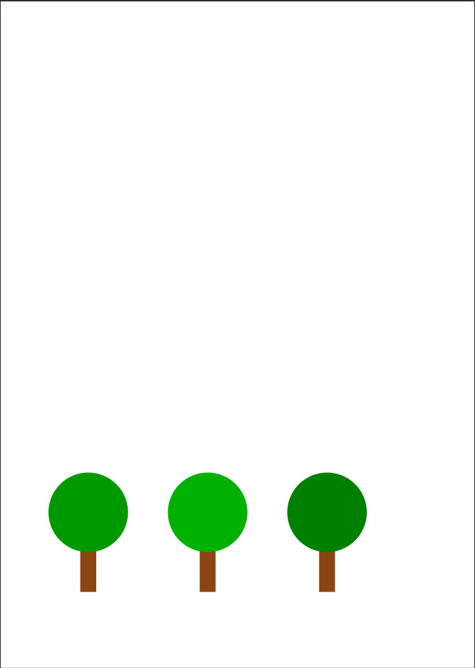
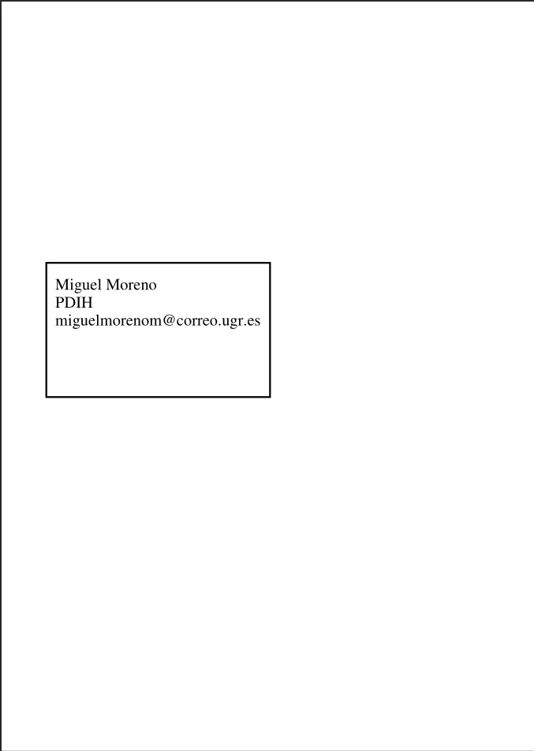
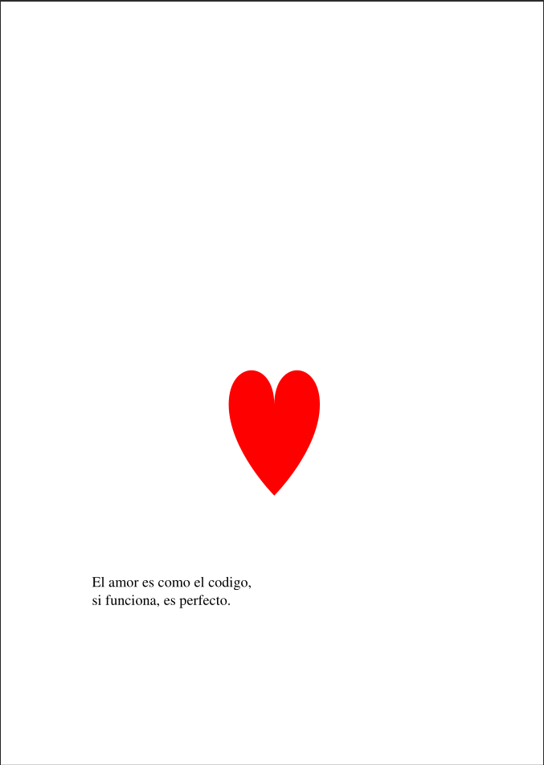
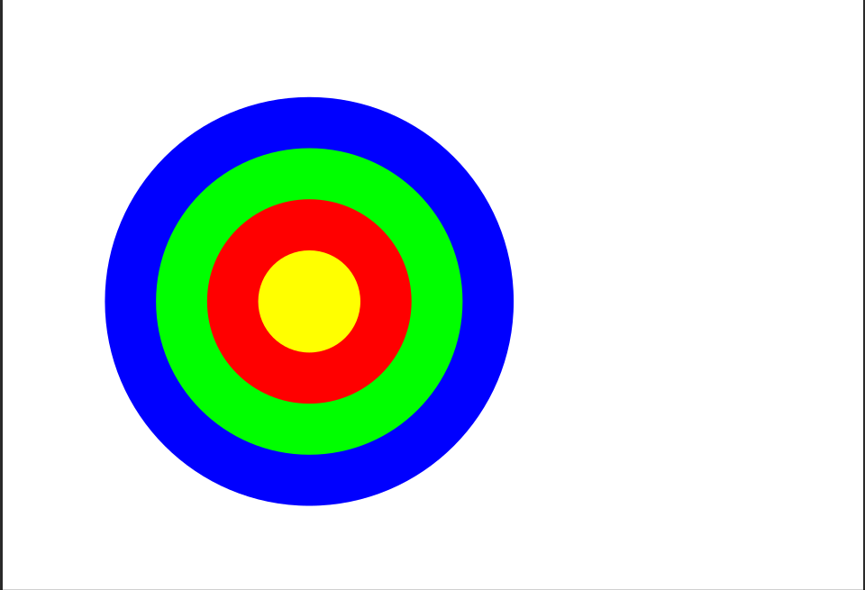
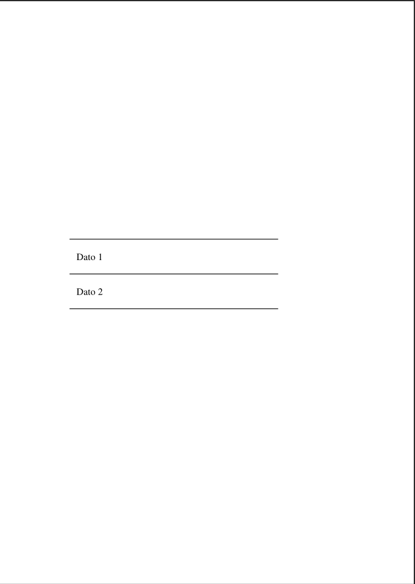
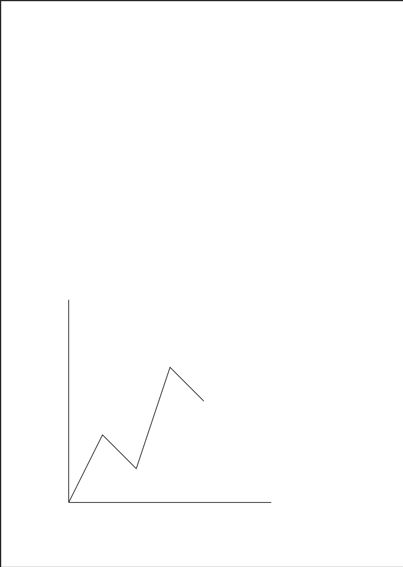

# Práctica 4 — El lenguaje PostScript

**Alumno:** Miguel Moreno Murcia  
**Curso/Grupo:** 4º  
**Asignatura:** PDIH

---

# 1. Introducción

En esta práctica se ha trabajado con el lenguaje PostScript (PS), un lenguaje de descripción de páginas utilizado para indicar a una impresora cómo debe representar gráficos y texto.

El objetivo principal ha sido aprender la sintaxis básica de PostScript y desarrollar varios programas capaces de generar figuras, texto y diseños gráficos utilizando comandos básicos del lenguaje.

Además, se ha aprendido a visualizar y convertir archivos `.ps` a otros formatos como PDF.

---

# 2. Herramientas utilizadas

Para realizar la práctica se han utilizado las siguientes herramientas:

* Editor de texto (Nano)
* Ghostscript
* ps2pdf
* Visor PDF
* Sistema operativo Linux Ubuntu

---

# 3.1 Instalación de Ghostscript

Para instalar Ghostscript en Ubuntu se ha utilizado el siguiente comando:

```bash
sudo apt install ghostscript
```

---

# 3.2 Conversión de archivos PS a PDF

Para convertir los archivos `.ps` a `.pdf` se ha utilizado el comando:

```bash
ps2pdf archivo.ps
```

Ejemplo:

```bash
ps2pdf arboles.ps
```

---

# Ejercicio 1 — Árboles

## Descripción

En este ejercicio se ha creado una escena formada por tres árboles utilizando figuras geométricas básicas.

Los troncos se han dibujado mediante rectángulos y las copas mediante círculos rellenos de color verde.

---

## Código fuente

```postscript
%!
newpath

% ===== Árbol 1 =====

% Tronco
0.55 0.27 0.07 setrgbcolor
100 100 moveto
120 100 lineto
120 160 lineto
100 160 lineto
closepath
fill

% Copa
0 0.6 0 setrgbcolor
110 200 50 0 360 arc
fill


% ===== Árbol 2 =====

% Tronco
0.55 0.27 0.07 setrgbcolor
250 100 moveto
270 100 lineto
270 160 lineto
250 160 lineto
closepath
fill

% Copa
0 0.7 0 setrgbcolor
260 200 50 0 360 arc
fill


% ===== Árbol 3 =====

% Tronco
0.55 0.27 0.07 setrgbcolor
400 100 moveto
420 100 lineto
420 160 lineto
400 160 lineto
closepath
fill

% Copa
0 0.5 0 setrgbcolor
410 200 50 0 360 arc
fill

showpage
```

---

## Explicación

* `setrgbcolor` se utiliza para cambiar el color.
* `moveto` mueve el lápiz a una coordenada.
* `lineto` dibuja líneas.
* `arc` dibuja círculos.
* `fill` rellena las figuras.
* `showpage` finaliza la página.

---

## Captura de pantalla

<p align="center">
  
</p>

---

# Ejercicio 2 — Tarjeta de visita

## Descripción

En este ejercicio se ha diseñado una tarjeta de visita sencilla utilizando texto y líneas.

---

## Código fuente

```postscript
%!
/Times-Roman findfont
18 scalefont
setfont

% Marco
newpath
50 400 moveto
300 400 lineto
300 550 lineto
50 550 lineto
closepath
2 setlinewidth
stroke

% Texto
newpath
60 520 moveto
(Miguel Moreno) show

60 500 moveto
(PDIH) show

60 480 moveto
(miguelmorenom@correo.ugr.es) show

stroke
showpage
```

---

## Explicación

* `findfont` selecciona la fuente.
* `scalefont` establece el tamaño.
* `setfont` aplica la fuente.
* `show` imprime texto.

---

## Captura de pantalla

<p align="center">
  
</p>

---

# Ejercicio 3 — Corazón y poesía

## Descripción

En este ejercicio se ha dibujado un corazón utilizando curvas y se ha añadido una pequeña poesía.

---

## Código fuente

```postscript
%!
newpath

1 0 0 setrgbcolor

% Corazón (aproximado con curvas)
300 400 moveto
300 450 350 450 350 400 curveto
350 350 300 300 300 300 curveto
300 300 250 350 250 400 curveto
250 450 300 450 300 400 curveto

fill

% Texto
0 0 0 setrgbcolor
/Times-Roman findfont
16 scalefont
setfont

100 200 moveto
(El amor es como el codigo,) show

100 180 moveto
(si funciona, es perfecto.) show

showpage
```

---

## Explicación

* `curveto` permite dibujar curvas.
* Se ha utilizado color rojo para el corazón.
* Después se ha añadido texto en negro.

---

## Captura de pantalla

<p align="center">
  
</p>

---

# Ejercicio adicional 1 — Círculos concéntricos

## Descripción

En este ejercicio se han creado varios círculos concéntricos de diferentes colores.

---

## Código fuente

```postscript
%!
<< /PageSize [842 595] >> setpagedevice

% Círculos
0 0 1 setrgbcolor
300 300 200 0 360 arc fill

0 1 0 setrgbcolor
300 300 150 0 360 arc fill

1 0 0 setrgbcolor
300 300 100 0 360 arc fill

1 1 0 setrgbcolor
300 300 50 0 360 arc fill

showpage
```

---

## Captura de pantalla

<p align="center">
  
</p>

---

# Ejercicio adicional 2 — Tabla y gráfica

## Descripción

En este ejercicio se han creado dos páginas:

1. Una tabla con datos.
2. Una gráfica sencilla.

---

## Código fuente

```postscript
%!
/Times-Roman findfont
14 scalefont
setfont

% Líneas tabla
newpath
100 500 moveto 400 500 lineto stroke
100 450 moveto 400 450 lineto stroke
100 400 moveto 400 400 lineto stroke

% Texto
110 470 moveto (Dato 1) show
110 420 moveto (Dato 2) show

showpage

% Página 2                                                                   
newpath

% Ejes
100 100 moveto
100 400 lineto
stroke

100 100 moveto
400 100 lineto
stroke

% Gráfica simple
newpath
100 100 moveto
150 200 lineto
200 150 lineto
250 300 lineto
300 250 lineto
stroke

showpage
```

---

## Captura de pantalla

<p align="center">
  
</p>

<p align="center">
  
</p>

---

# Conclusiones

Gracias a esta práctica se ha aprendido el funcionamiento básico del lenguaje PostScript y la forma de generar gráficos y texto mediante programación.

También se ha aprendido a convertir archivos PS a PDF y a trabajar con herramientas como Ghostscript.

PostScript permite generar documentos gráficos de manera precisa utilizando únicamente instrucciones de texto.

---