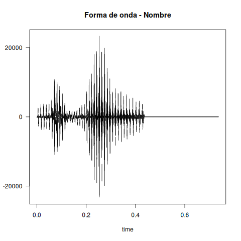
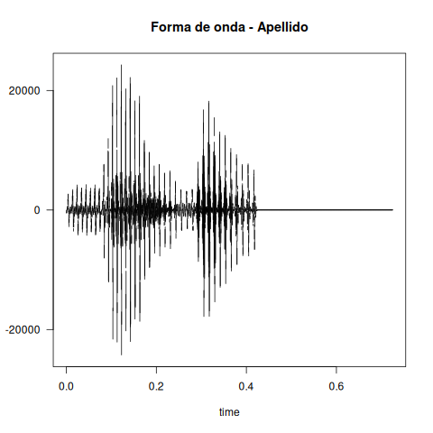
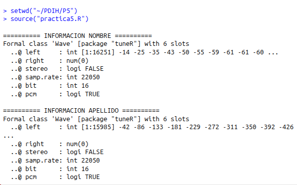
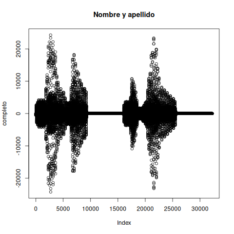

# Práctica 5 — Experimentación con el sistema de salida de sonido en R

**Alumno:** Miguel Moreno Murcia  
**Curso/Grupo:** 4º  
**Asignatura:** PDIH

---

# 1. Introducción

En esta práctica se ha trabajado con el procesamiento de sonido en R utilizando los paquetes `tuneR` y `seewave`.

El objetivo principal ha sido aprender a leer, visualizar, manipular y reproducir señales de audio en formato WAV, así como aplicar distintos efectos como filtrado de frecuencias, eco e inversión del sonido.

Además, se ha aprendido a interpretar la estructura interna de un archivo de sonido y a generar nuevos ficheros modificados a partir de señales originales.

---

# 2. Herramientas utilizadas

Para realizar la práctica se han utilizado las siguientes herramientas:

* R y RStudio
* Paquetes: `tuneR` y `seewave`
* Archivos WAV (nombre.wav y apellido.wav)
* Sistema operativo Linux

---

# 3. Instalación de paquetes

Para instalar los paquetes necesarios en R se han utilizado los siguientes comandos:

```r
install.packages("tuneR")
install.packages("seewave")
```

---

# 4. Carga de librerías

```r
library(tuneR)
library(seewave)
```

---

# Ejercicio 1 — Lectura de archivos de sonido

## Descripción

En este ejercicio se han cargado dos archivos de sonido en formato WAV que contienen mi nombre y mi primer apellido.

## Código fuente

```r
nombre <- readWave("nombre.wav")
apellido <- readWave("apellido.wav")
```

### - Audio del nombre

<audio controls>
  <source src="./nombre.wav" type="audio/wav">
  Tu navegador no soporta audio.
</audio>

### - Audio del apellido

<audio controls>
  <source src="./apellido.wav" type="audio/wav">
  Tu navegador no soporta audio.
</audio>

---

# Ejercicio 2 — Representación de la forma de onda

## Descripción

Se ha representado gráficamente la forma de onda de ambos sonidos.

## Código fuente

```r
png("onda_nombre.png")
plot(nombre, main = "Forma de onda - Nombre")
dev.off()

png("onda_apellido.png")
plot(apellido, main = "Forma de onda - Apellido")
dev.off()

plot(nombre, main = "Forma de onda - Nombre")
plot(apellido, main = "Forma de onda - Apellido")
```

<p align="center">
  
</p>


<p align="center">
  
</p>


---
# Ejercicio 3 — Información de cabeceras

## Descripción

Se ha utilizado la función str() para obtener información interna de los archivos de audio, como frecuencia de muestreo, duración y tipo de señal.

## Código fuente

```r
cat("\n========== INFORMACION NOMBRE ==========\n")
str(nombre)

cat("\n========== INFORMACION APELLIDO ==========\n")
str(apellido)
```

<p align="center">
  
</p>

---
# Ejercicio 4 — Unión de sonidos

## Descripción

Se han unido los dos sonidos (nombre y apellido) en una sola señal para su reproducción continua.

## Código fuente

```r
completo <- pastew(nombre, apellido, output = "Wave")
```

---
# Ejercicio 5 — Visualización y reproducción del sonido unido

## Descripción

Se ha representado la forma de onda del sonido completo y se ha reproducido.

## Código fuente

```r
png("onda_completa.png")
plot(completo, main = "Nombre y apellido")
dev.off()

plot(completo, main = "Nombre y apellido")

listen(completo)
```

<p align="center">
  
</p>

---

# Ejercicio 6 — Guardado del sonido básico

## Descripción

El sonido resultante de la unión del nombre y apellido se ha guardado en un archivo WAV llamado basico.wav.

## Código fuente

```r
writeWave(completo, "basico.wav")
```

### - Audio completo

<audio controls>
  <source src="./basico.wav" type="audio/wav">
  Tu navegador no soporta audio.
</audio>

---